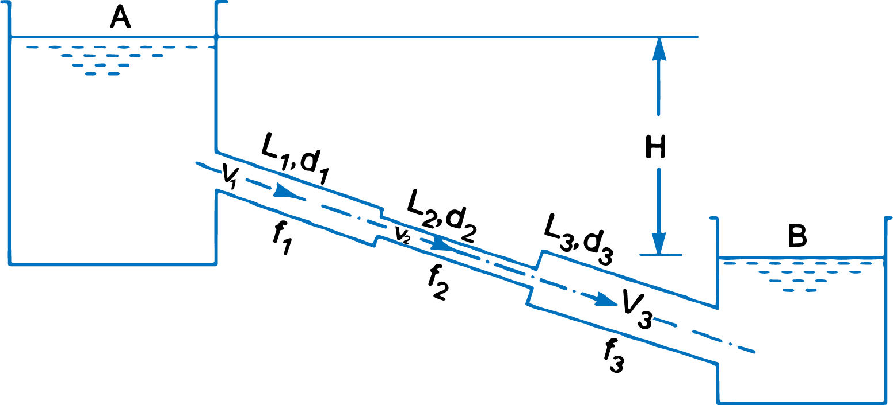
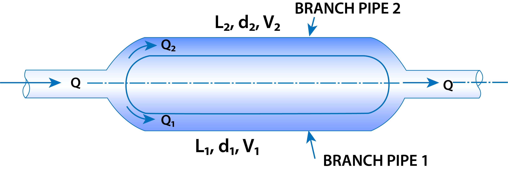
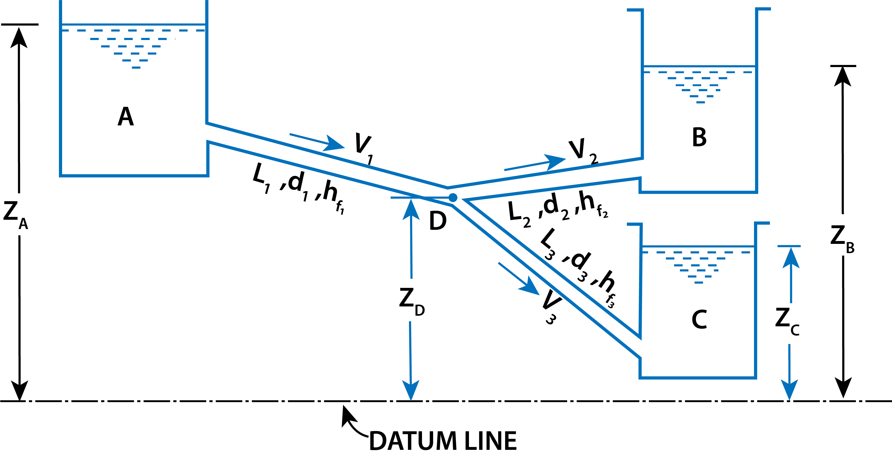

<h2>1. FLOW THROUGH PIPES IN SERIES OR FLOW THROUGH COMPOUND PIPES</h2>

   &emsp; Pipes in series or compound pipes are defined as the pipes of different lengths and different diameters connected end to end (in series) to form a pipe line as shown in Fig. 1

$$
   \begin{aligned}
      \text{Let,} \qquad L_1,L_2,L_3 &= \text{length of pipes  1, 2 and 3 respectively} \\
      d_1,d_2,d_3 &= \text{diameter of pipes 1, 2, 3 respecively} \\ 
      V_1,V_2,V_3 &= \text{velocity of flow through pipes 1, 2, 3} \\
      f_1,f_2,f_3 &= \text{co-efficient of frictions for pipes 1, 2, 3} \\
      H &= \text{difference of water level in the two tanks.}
   \end{aligned}
$$

$$ Fig.1 $$

The discharge passing through each pipe is same.

$$
   ∴ \qquad \qquad Q = A_1V_1 = A_2V_2 = A_3V_3
$$

The difference in liquid surface levels is equal to the sum of the total head loss in the pipes.

$$
   ∴ \ H = \frac{0.5V_1^2}{2g} + \frac{4f_1L_1V_1^2}{d_1 × 2g} + \frac{0.5V_2^2}{2g} + \frac{4f_2L_2V_2^2}{d_2 × 2g} + \frac{(V_2 - V_3)^2}{2g} + \frac{4f_3L_3V_3^2}{d_3\times2g} + \frac{V_3^2}{2g} \tag{equ. 1}
$$

   If minor losses are neglected, then above equation becomes as

$$
   H = \frac{4f_1L_1V_1^2}{d_1 × 2g} + \frac{4f_2L_2V_2^2}{d_2 × 2g} + \frac{4f_3L_3V_3^2}{d_3 × 2g} \tag{equ. 2}
$$

If the co-efficient of friction is same for all pipes

$$
   \text{i.e.,} \qquad \qquad f_1 = f_2= f_3 = f, \ \ \text{then equation(2) becomes as} \\
$$

$$
      H = \frac{4fL_1V_1^2}{d_1 × 2g} + \frac{4fL_2V_2^2}{d_2 × 2g} + \frac{4fL_3V_3^2}{d_3 × 2g} 
$$
$$
      H = \frac{4f}{2g}\left[\frac{L_1V_1^2}{d_1} + \frac{L_2V_2^2}{d_2}+\frac{L_3V_3^2}{d_3}\right] \tag{equ. 3}
$$

 

<h2>2. EQUIVALENT PIPE</h2>

   &emsp; This is defined as the pipe of uniform diameter having loss of head and discharge equal to the loss of head and discharge of a compound pipe consisting of several pipes of different lengths and diameters. The uniform diameter of the equivalent pipe is called equivalent size of the pipe. The length of equivalent pipe is equal to sum of lengths of the compound pipe consisting of different pipes.

$$
   \begin{aligned}
      \text{Let,} \qquad L_1 &= \text{length of pipe 1 and} \ \ d_1 = \text{diameter of pipe 1} \\
      L_2 &= \text{length of pipe 2 and} \ \ d_2 = \text{diameter of pipe 2} \\
      L_3 &= \text{length of pipe 3 and} \ \ d_3 = \text{diameter of pipe 3} \\
      H &= \text{total head loss} \\ 
      L &= \text{length of equivalent pipe} \\ 
      d &= \text{diameter of the equivalent pipe} \\
      \text{Then,} \qquad L &= L_1  +  L_2 + L_3
   \end{aligned}
$$

Total head loss in the compound pipe, neglecting minor losses

$$
   H =  \frac{4f_1L_1V_1^2}{d_1 × 2g} +  \frac{4f_2L_2V_2^2}{d_2 × 2g} + \frac{4f_3L_3V_3^2}{d_3 × 2g} \tag{equ. 3A}
$$

Assuming

$$
    f_1 = f_2  = f_3 = f
$$

Discharge,

$$
   Q=A_1V_1 = A_2V_2 = A_3V_3 = \frac{\pi}{4}d_1^2V_1 = \frac{\pi}{4}d_2^2V_2 = \frac{\pi}{4}d_3^2V_3
$$

$$
   ∴ \qquad \qquad V_1 = \frac{4Q}{πd_1^2},\ \ V_2 =  \frac{4Q}{πd_2^2},\ \ V_3 = \frac{4Q}{πd_3^2}
$$

Substituting these values in equation (3A), we have

$$
   H = \frac{4fL_1 × \left(\frac{4Q}{πd_1^2}\right)^2}{d_1 × 2g} + \frac{4fL_2 × \left(\frac{4Q}{πd_2^2}\right)^2}{d_2 × 2g} + \frac{4fL_3 × \left(\frac{4Q}{πd_3^2}\right)^2}{d_3 × 2g}
$$

$$
   H = \frac{4×16fQ^2}{\pi^2 \times 2g}\left[\frac{L_1}{d_1^5} + \frac{L_2}{d_2^5} +  \frac{L_3}{d_3^5}\right] \tag{equ. 4}
$$

Head loss in the equivalent pipe,

$$
   H = \frac{4f⋅ L ⋅ V^2 }{d × 2g} \left[\text{Taking same value of f as in compound pipe}\right]
$$

where

$$
   V = \frac{Q}{A} = \frac{Q}{\frac{\pi}{4}d^2} = \frac{4Q}{π d^2}
$$

$$
   ∴ \qquad \qquad H = \frac{4f⋅ L⋅ \left(\frac{4Q}{πd^2}\right)^2}{d × 2g} = \frac{4 × 16Q^2f}{π^2 × 2g}\left[\frac{L}{d^5}\right] \tag{equ. 5} 
$$

   Head loss in compound pipe and in equivalent pipe is same hence equating equations(4) and equation(5), we have

$$
   \frac{4 × 16fQ^2}{π^2×2g} \left[\frac{L_1}{d_1^5} + \frac{L_2}{d_2^5} + \frac{L_3}{d_3^5}\right]  = \frac{4 × 16Q^2f}{\pi^2 × 2g}\left[\frac{L}{d^5}\right]
$$

$$
   or \quad \frac{L_1}{d_1^5} + \frac{L_2}{d_2^5} + \frac{L_3}{d_3^5} = \frac{L}{d^5} \quad or \quad \frac{L}{d^5} =\frac{L_1}{d_1^5} + \frac{L_2}{d_2^5} + \frac{L_3}{d_3^5} \tag{equ. 6}
$$

   &emsp; Equation(6) is known as Dupuit's equation. In this equation L = L1 + L2 + L3 and d1, d2  and d3 are known. Hence  the equivalent size of the pipe, i.e., value of d can be obtained.

 

<h2>3. FLOW THROUGH PARALLEL PIPES</h2>

   &emsp; Consider a main pipe which divides into two or more branches as shown in Fig. 2 and again join together downstream to form a single pipe, then the branch pipes are said to be connected in parallel. The discharge through the main is increased by connecting pipes in parallel.

$$ Fig.2 $$

The rate of flow in the main pipe is equal to the sum of rate of flow through branch pipes. Hence  from Fig. 2, we have

$$ Q = Q_1 + Q_2 \tag{equ. 7}$$

In this, arrangement, the loss of head for each branch pipe is same.  
&therefore; Loss of head for branch pipe 1 = Loss of head for branch pipe 2

 

$$
   \text{or} \qquad \qquad \frac{4f_1L_1V_1^2}{d_1 × 2g} = \frac{4f_2L_2V_2^2}{d_2 × 2g} \tag{equ. 8}
$$

 

$$
   \text{If} \qquad \qquad f_1 = f_2, \quad \text{then} \quad \frac{L_1V_1^2}{d_1 × 2g} = \frac{L_2V_2^2}{d_2 × 2g} \tag{equ. 9}
$$

<h2>4. FLOW THROUGH BRANCHED PIPES</h2>

   &emsp; When three or more reservoirs are connected by means of pipes, having one or more junctions, the system is called a branching pipe system. Fig. 11.26 shows three reservoirs at different levels connected to a single junction, by means of pipes which are called branched pipes. The lengths, diameters and co-efficient of friction of each pipes is given. It is required to find the discharge and direction of flow in each pipe. The basic equations used for solving such problems are :
   <ol>
      <li>
         <strong>Continuity equation</strong> which means the inflow of fluid at the junction should be equal to the outflow of fluid
      </li>
      <li>
         <strong>Bernoulli's equation</strong> and
      </li>
      <li>
         <strong>Darcy-Weisbach equation</strong>
      </li>
   </ol>

   &emsp; Also it is assumed that reservoirs are very large and the water surface levels in the reservoirs are constant so that steady conditions exist in the pipes. Also minor losses are assumed very small. The flow from reservoir A takes place to junction D. The flow from junction D is towards reservoirs C. Now the flow from junction D towards reservoir B will take place only when piezometric head at D (which is equal to PD/&rho;g  + ZD) is more than the Piezometric head at B (i.e., ZB). Let us consider that flow is from D to reservoir B

$$ Fig.3 $$

   For flow from A to D from Bernoulli's equation 

$$
   Z_A = Z_D  + \frac{P_D}{ρg} + h_{f_1} \tag{i}
$$

   For flow from D to B from Bernoulli's equation  

$$
   Z_D + \frac{P_D}{ρg} = Z_B + h_{f_2} \tag{ii}
$$

   For flow from D to C from Bernoulli's equation 

$$
   Z_D + \frac{P_D}{ρg} = Z_C + h_{f_3} \tag{iii}
$$

   From continuity equation,  
   Discharge through AD = Discharge through DB + Discharge through DC

$$
   ∴ \qquad \qquad \frac{π}{4}d_1^2V_1 = \frac{\pi}{4}d_2^2 × V_2 + \frac{π}{4}d_3^2V_3
$$

$$
   \text{or} \qquad \qquad d_1^2V_1 = d_2^2V_2 +  d_3^2V_3 \tag{iv}
$$

   There are four unknowns i.e., V1, V2, V3  and PD/&rho;g and there are four equations (i), (ii), (iii) and (iv).  
   Hence unknowns can be calculated.

